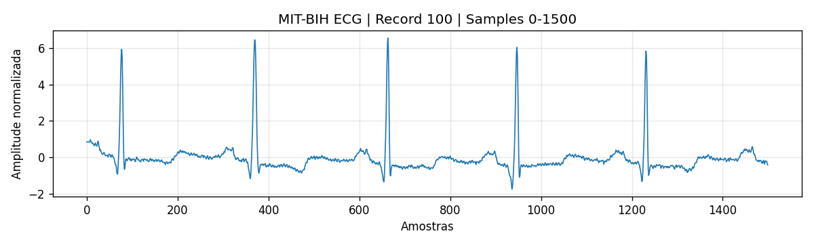
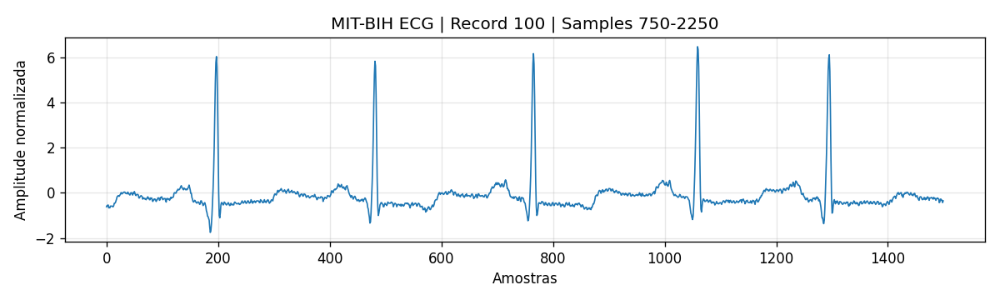
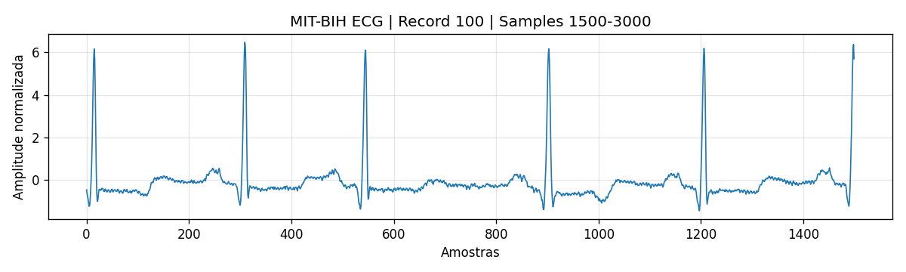

# FIAP - Faculdade de Informática e Administração Paulista  

<p align="center">
<a href= "https://www.fiap.com.br/"></a>
</p>

<br>

# 2TIAOA


## Fase 1 -- Capítulo 1

### Cap 1 - A Busca de Dados: Preparando o Terreno para a Inteligência Cardiológica

------------------------------------------------------------------------

## 👨‍🎓 Integrantes do Grupo 37

-   **Deivisson Gonçalves Lima** -- RM565095\
-   Email: deivisson.engtele@gmail.com\
-   LinkedIn: https://www.linkedin.com/in/deivisson-lima

------------------------------------------------------------------------

## 👩‍🏫 Professores

### Tutor

-   Caique Nonato da Silva Bezerra

### Coordenador

-   André Godoi Chiovato

------------------------------------------------------------------------

## 📜 Descrição

Este projeto faz parte do programa de aprendizagem baseado em projetos
(PBL) do curso de Inteligência Artificial da FIAP e integra o projeto
**CardioIA**, que tem como objetivo simular um ecossistema digital de
cardiologia inteligente.

Nesta primeira fase do projeto, denominada **"Batimentos de Dados"**, os
alunos assumem o papel de cientistas de dados hospitalares, sendo
responsáveis por buscar, organizar e preparar diferentes tipos de dados
que poderão alimentar sistemas inteligentes nas fases futuras do
projeto.

O objetivo principal desta atividade é estruturar três tipos
fundamentais de dados utilizados em aplicações de Inteligência
Artificial voltadas à área da saúde:

-   Dados numéricos clínicos
-   Dados textuais médicos
-   Dados visuais provenientes de exames cardiológicos

Os dados numéricos representam informações clínicas de pacientes, como
idade, pressão arterial, frequência cardíaca e níveis de colesterol,
utilizados em modelos de Machine Learning para identificar fatores de
risco associados a doenças cardiovasculares.

Os dados textuais representam conteúdos relacionados à saúde
cardiovascular, permitindo aplicação de técnicas de **Processamento de
Linguagem Natural (NLP)** para extração de sintomas, classificação de
tópicos e análise de informações médicas.

Os dados visuais correspondem a imagens de eletrocardiograma (ECG),
utilizadas em pesquisas de **Visão Computacional** para identificação de
padrões cardíacos e detecção de possíveis anomalias.

As imagens utilizadas neste projeto foram geradas a partir do dataset
científico **MIT-BIH Arrhythmia Database**, disponibilizado pelo
repositório PhysioNet.

------------------------------------------------------------------------

## 📁 Estrutura de Pastas

A estrutura do repositório foi organizada da seguinte forma:

cardioia-fase1-dados-cardiologicos
│
├── README.md
│
├── assets
│ ├── logo-fiap.png
│ └── ecg_images
│ └── imagens de eletrocardiogramas utilizadas para experimentos de Visão Computacional
│
├── datasets
│ └── pacientes_cardiacos_300.csv
│
├── docs
│ ├── texto_cardiologia_1.txt
│ └── texto_cardiologia_2.txt
│
└── scripts
├── generate_cardiology_dataset.py
└── convert_mitbih_to_images.py


- **assets**: contém imagens utilizadas no projeto, incluindo ECGs e o logotipo institucional.  

- **datasets**: armazena os dados estruturados utilizados para análises de Machine Learning.  

- **docs**: contém textos utilizados para experimentos de Processamento de Linguagem Natural (NLP).  

- **scripts**: contém scripts auxiliares utilizados para geração de datasets e conversão de sinais ECG em imagens.  

- **README.md**: documento principal do projeto com descrição geral e instruções.


## 📂 Acesso aos Dados

Devido ao volume de dados e imagens utilizadas no projeto, os arquivos completos estão disponíveis no Google Drive:

https://drive.google.com/drive/folders/13gu3Cdxx5FovkigBw733YzIdH6SE1b2s?usp=sharing

O repositório GitHub contém apenas a estrutura do projeto e exemplos representativos dos dados.

------------------------------------------------------------------------

## 🧩 Estrutura Utilizada em Projetos de IA

A organização deste repositório segue boas práticas utilizadas em projetos profissionais de Inteligência Artificial e Ciência de Dados.

Separar os componentes do projeto em diferentes pastas permite melhor organização e escalabilidade do desenvolvimento.

Principais categorias de dados utilizadas:

**Dados Estruturados**
- datasets clínicos
- variáveis numéricas para modelos de Machine Learning

**Dados Não Estruturados**
- textos médicos utilizados para NLP
- imagens ECG utilizadas para Visão Computacional

Essa separação facilita o desenvolvimento de pipelines de dados e o treinamento de diferentes modelos de IA nas próximas fases do projeto.

------------------------------------------------------------------------

## 🫀 Preview das Imagens de ECG

Abaixo estão exemplos de imagens de eletrocardiograma utilizadas no projeto.  
Essas imagens foram geradas a partir do dataset científico **MIT-BIH Arrhythmia Database**.

<p align="center">





</p>

Essas imagens representam trechos do sinal elétrico do coração e podem ser utilizadas para treinar algoritmos de **Visão Computacional**, especialmente modelos baseados em **Redes Neurais Convolucionais (CNNs)**.

------------------------------------------------------------------------

## 🧠 Arquitetura Conceitual do Projeto CardioIA

O projeto CardioIA integra diferentes fontes de dados e tecnologias de Inteligência Artificial para análise e interpretação de informações cardiológicas.

------------------------------------------------------------------------

                ┌─────────────────────────┐
                │  Dados Clínicos (CSV)   │
                │  Idade, Pressão, etc   │
                └────────────┬────────────┘
                             │
                             ▼
                    ┌─────────────────┐
                    │ Machine Learning │
                    │  Análise de Risco│
                    └─────────────────┘

                ┌─────────────────────────┐
                │ Textos Médicos (.txt)   │
                │ Sintomas / Doenças      │
                └────────────┬────────────┘
                             │
                             ▼
                   ┌──────────────────┐
                   │ NLP Processing   │
                   │ Extração de info │
                   └──────────────────┘

                ┌─────────────────────────┐
                │ Imagens ECG (.png)      │
                │ Sinais cardíacos        │
                └────────────┬────────────┘
                             │
                             ▼
                   ┌──────────────────┐
                   │ Computer Vision  │
                   │ Detecção padrões │
                   └──────────────────┘

                             │
                             ▼

                   ┌──────────────────┐
                   │     CardioIA     │
                   │ Plataforma IA    │
                   │ para Cardiologia │
                   └──────────────────┘

------------------------------------------------------------------------

## 🔧 Como Executar o Código

Pré‑requisitos:

Python 3.9 ou superior

Bibliotecas utilizadas:

    pandas
    numpy
    wfdb
    matplotlib
    openpyxl

Instalação das dependências:

``` bash
pip install pandas numpy wfdb matplotlib openpyxl
```

### Gerar dataset numérico

``` bash
python scripts/generate_cardiology_dataset.py
```

### Gerar imagens ECG

``` bash
python scripts/convert_mitbih_to_images.py
```

------------------------------------------------------------------------

## 📊 Links para os Dados

Datasets utilizados no projeto:

https://drive.google.com/drive/folders/13gu3Cdxx5FovkigBw733YzIdH6SE1b2s?usp=sharing

Estrutura dos dados:

-   Dataset_Numerico
-   Dados_Textuais
-   Imagens_ECG

------------------------------------------------------------------------

## 📚 Referências

Goldberger, A. L. et al. (2000).\
PhysioBank, PhysioToolkit, and PhysioNet.

MIT-BIH Arrhythmia Database\
https://physionet.org/content/mitdb/1.0.0/

ECG Image Dataset\
https://www.kaggle.com/datasets/andrewmvd/ecg-images

------------------------------------------------------------------------

## 🗃 Histórico de Lançamentos

-   0.1.0 - 2026
    -   Estrutura inicial do projeto\
    -   Inclusão de datasets numéricos, textuais e visuais

------------------------------------------------------------------------

## 📋 Licença

Projeto acadêmico desenvolvido para fins educacionais no curso de
Inteligência Artificial da FIAP.
